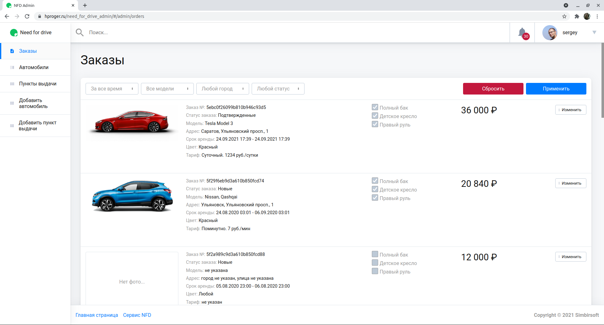

# need_for_drive_admin
Административная панель для сервиса каршеринга Need for drive

Это учебный проект по созданию административной панели для гипотетического сервиса каршеринга, разработанный в рамках летнего практикума в компании S****t. Название компании я скрыл за звездочками по просьбе менторов проекта, дабы предотвратить возможный плагиат со стороны участников будущих практикумов.

Проект полностью написан на React. Использованы также библиотеки React Router и Redux.

Также в проекте есть запароленный файл с архивом .env.zip. В этом файле находятся токены для подключенных внешних сервисов. При клоноровании проекта файл нужно просто распаковать в папку с проектом. Ключ к архиву: En741963 

После клонирования репозитория для запуска проекта нужно последовательно выполнить команды ```npm install``` и ```npm run start```

[ссылка на запущенный сервис](https://hproger.ru/need_for_drive_admin/#/)

Для входа в сервис можно использовать следующую пару лигин/пароль: sergey/sergey. Также можно зарегистрироваться самостоятельно.





